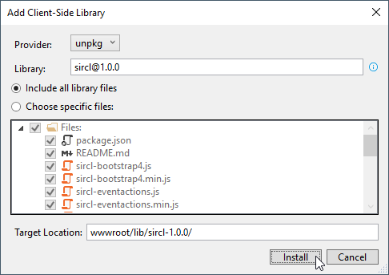

Sircl
=====

## Introduction

Sircl is a Javascript(/CSS) library to support server-side rendering.

The library facilitates developing web applications with server-side rendering as with ASP.NET MVC, Java Servlets and JSP, PHP, etc, by eliminating most needs for client-side scripting while offering a fluent, rich, almost "single-page" experience to endusers.

## Installation

### By downloading files

Download the files in the "dist" subdirectory of the version you want, and reference your copies from within your web pages.

The download includes following files:

- README.md
- sircl.css (min, full)
- sircl.js (min, full)
- sircl-bootstrap4.js (min)
- sircl-eventactions.js (min, full)
- sircl-fa.js (min)
- sircl-legacy.css (min)
- sircl-legacy.js (min)
- sircl-unicons.js (min, full)

Above files followed by 'min' between brackets, also exist in minified version.

Above files followed by 'full' between brackets, are part of the bundled "full" files:

- sircl-full.min.css
- sircl-full.min.js

So if you want to use all of Sircl (except legacy items) in combination with Bootstrap 4 and Font Awesome, you should include following references:

~~~html
<link  href="/lib/sircl-1.0/sircl-full.min.css" rel="stylesheet" />

~~~

### Using jsDeliver

Using [jsDeliver](https://www.jsdelivr.com/), you can reference files from GitHub, as in:

~~~html
<link  href="https://cdn.jsdelivr.net/gh/codetuner/sircl/dist/sircl-1.0/sircl-full.min.css" rel="stylesheet" />

~~~

### Using Library Manager in Visual Studio

If you are using Visual Studio (2017 or higher), you can also use the new [Library Manager](https://devblogs.microsoft.com/aspnet/library-manager-release-in-15-8/) (libman) to instal Sircl.

Under the "wwwroot" folder of your web project, create a "lib" directory, then right-click on that directory and choose "Add", then "Client-Side Library...".

Choose "unpkg" as provider, enter "sircl@1.0.0" as library name or choose the latest version.

Choose to include all library files, or select the files you need.

I strongly suggest to change the target location to include the version number, as described in the About versioning section of this documentation.

Confirm by pressing the Install button.

### Using npm

Sircl is also [published on NPP](https://www.npmjs.com/package/sircl).

You can install it with the npm command-line interface:

~~~
> npm i sircl
~~~

### About versioning

I have choosen not to include the version number in the filename as is often done, because I don't believe it is a good practice
to repeat the version on each file in a multi-file package. It makes upgrading, searching & replacing harder and more error prone.

Instead, I strongly recommend you to use a version number in the directory name, as is done in the dist directory.

Including the version number in the path of file resources helps idenitfying versions used and diagnose compatibility issues, allows
side-by-side execution and provides support for far-future expiration.

## Documentation

For now, the [reference documentation](doc/sircl-ref.md) is your best information source.

A [recipe documentation](doc/sircl-recip.md) is in working progress.

